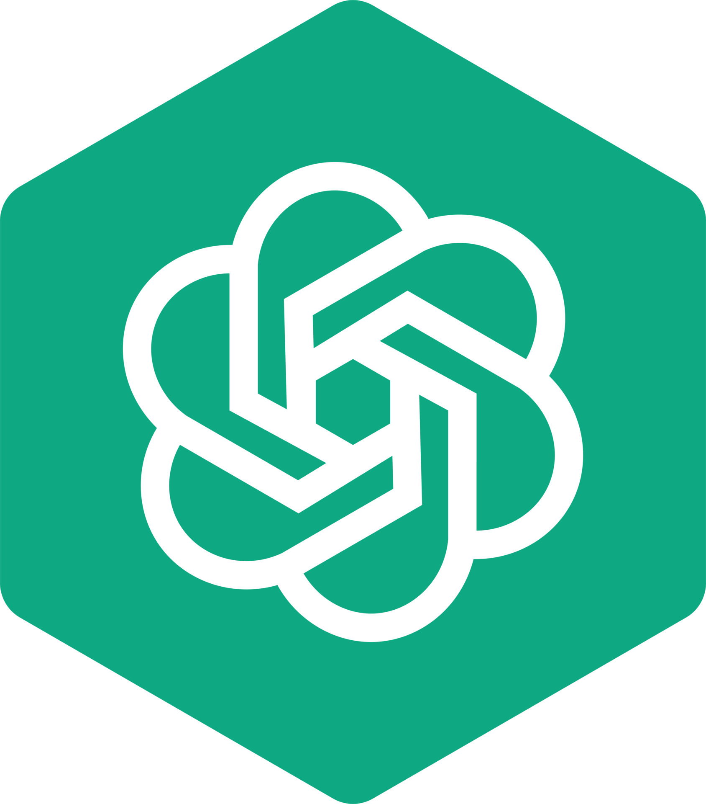

<link rel="stylesheet" href="custom.css">

<h1 align="center">WELCOME TO MY PAGE 👋👋👋</h1>

### 👨‍💻 BIO 👨‍💻:
- Hi, my name is Hoang
- I'm a M2 at INSA de Rennes, major in Computer Science
- My passion is to work in the field of AI or Data. I want to become a data scientist
- I like playing baseball, playing piano, reading manga, playing league of legends and eating.

### Connect with me:

<!-- Done have anything for now -->

---
<h1 align="center">My repository</h1>

<table>
<tr>
<td>
    

    

</td>

<td>

 

</td>
</tr>
</table>

<h1 align="center">⚡⚡TECHSTACK⚡⚡</h1>

### Web:

           

### Application

    

### Languages:

       

     
          
### Devops:

          

### Data and AI tools:    

            

